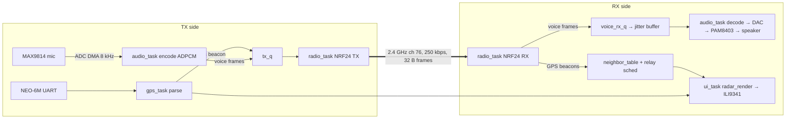

# 01 — System & Firmware Architecture

## Repository layout

```
ConvoyLink/
├── docs/                      # Design docs — the source of truth
├── tasks/                     # Implementation task queue + STATUS.md
├── firmware/
│   ├── components/            # ESP-IDF components (shared code)
│   │   ├── convoy_proto/      # Packet formats + (de)serialisation   [pure C]
│   │   ├── convoy_geo/        # Geodesy math (equirect, bearing)     [pure C]
│   │   ├── adpcm/             # IMA ADPCM encode/decode              [pure C]
│   │   ├── nmea/              # NMEA 0183 parser (RMC/GGA)           [pure C]
│   │   ├── neighbor_table/    # Per-car state, staleness, relay dedup[pure C]
│   │   ├── radar_render/      # RGB565 framebuffer gfx + radar UI    [pure C]
│   │   ├── nrf24/             # NRF24L01+ SPI driver                 [ESP32]
│   │   ├── gps_uart/          # UART glue feeding nmea               [ESP32]
│   │   ├── audio_io/          # ADC capture / DAC playback, half-dup [ESP32]
│   │   └── ili9341_disp/      # esp_lcd wrapper, strip flushing      [ESP32]
│   └── apps/                  # Each subdir = standalone ESP-IDF project
│       ├── convoylink/        # The real firmware
│       ├── bringup_display/   # Test pattern + FPS counter
│       ├── bringup_gps/       # NMEA echo + parsed fix printout
│       ├── bringup_radio/     # Ping-pong + broadcast loss-rate test
│       └── bringup_audio/     # Serial menu: tone / mic meter / loopback
├── sim/                       # Desktop radar simulator (SDL2, reuses pure-C components)
├── test/host/                 # Host unit tests for all pure-C components (gcc + make)
├── tools/                     # CI build script, helper scripts
└── .github/workflows/ci.yml   # Host tests + all-apps firmware build
```

**Pure C** components must compile with plain `gcc -std=c11` and no ESP-IDF
headers — that is what makes them host-testable and simulator-reusable. They
may not call `esp_*`, FreeRTOS, or allocate after init. Hardware components
wrap them.

## The two-plane design

Everything separates into a **data plane** (position awareness — beacons,
neighbour table, radar) and a **voice plane** (PTT audio). They share one
radio, arbitrated by simple rules (`docs/03`, §Airtime). Either plane works
without the other: the radar milestone (M4) ships before voice exists.

## FreeRTOS task layout (app `convoylink`)

Classic ESP32, two cores. Radio + audio timing lives on core 1 ("APP"),
leaving core 0 ("PRO") for UI, GPS, and housekeeping.

| Task | Core | Prio | Period / trigger | Role |
|---|---|---|---|---|
| `radio_task` | 1 | 12 | NRF24 IRQ (GPIO) + TX queue | Owns the radio exclusively. Drains RX FIFO, dispatches by packet type; sends whatever is in `tx_q` |
| `audio_task` | 1 | 11 | DMA callbacks / PTT events | Runs capture→encode (TX) or jitter-buffer→decode→playback (RX). Owns `audio_io` |
| `gps_task` | 0 | 6 | UART RX events | Feeds bytes to `nmea`, publishes fixes to `state`, queues own beacon every 5 s |
| `ui_task` | 0 | 4 | 200 ms tick | Reads `state` snapshot, renders radar via `radar_render`, flushes strips to LCD |
| `ctrl_task` | 0 | 5 | GPIO events, 50 ms debounce tick | PTT button, volume/zoom buttons, drives audio/radio mode changes |

### Shared state & queues (no ad-hoc globals)

```
state (struct convoy_state, mutex-guarded, snapshot-copied by readers)
 ├── own_fix        (nmea_fix_t + fix age)
 ├── neighbors      (neighbor_table_t)
 └── voice_status   (IDLE / TX / RX(uid), for UI)

tx_q      radio_task  ← gps_task (beacons), audio_task (voice frames), relay scheduler
voice_rx_q audio_task ← radio_task (voice frames, raw 32 B)
```

Rules: `radio_task` is the **only** task touching the NRF24. `audio_task` is
the only one touching `audio_io`. `ui_task` never blocks on anything but its
tick. All queues are fixed-depth, drop-oldest on overflow, depth documented
in code. No heap allocation after `app_main` finishes init.

## Dataflow



## Memory budget (ESP32-WROOM: ~320 KB DRAM, ~200 KB free after Wi-Fi stays off)

| Buffer | Size | Notes |
|---|---|---|
| LCD strip buffer | 240 × 24 px × 2 B × 2 = 23 KB | Double-buffered strips; full 240×320 framebuffer (150 KB) is deliberately NOT used |
| Audio capture DMA | 4 × 512 B = 2 KB | `adc_continuous` |
| Audio playback DMA | 4 × 512 B = 2 KB | `dac_continuous` |
| Jitter buffer | 16 × 32 B | Voice frames |
| Decode PCM scratch | 2 KB | |
| Neighbour table | 5 × ~64 B | Static |
| Queues + stacks | ~24 KB | Stack sizes in code, reviewed per task |

Wi-Fi and Bluetooth are **never initialised** (NRF24 is the only radio) —
that keeps RAM free and removes the ADC2 restriction, though we still use
ADC1 by convention.

## Error-handling conventions

- Pure-C components: return `int` (0 = OK, negative = error enum in the
  component's header). No `assert()` in library code; validate inputs.
- ESP components: return `esp_err_t`, log with `ESP_LOGx` using the
  component name as tag.
- The firmware must run forever with **any** peripheral absent: no GPS fix →
  radar shows "NO FIX" state; radio init fails → red status + retry every 5 s;
  never `abort()` on peripheral errors.

## Configuration & identity

All five units run an **identical binary**. Unit identity (`unit_id` 0–4 +
two ASCII initials) lives in NVS, set once over the serial console on first
boot (`docs/07`, §Provisioning). Compile-time tunables (channel, beacon
period, buffer depths) live in `components/convoy_proto/include/convoy_cfg.h`
so the simulator sees the same numbers.
