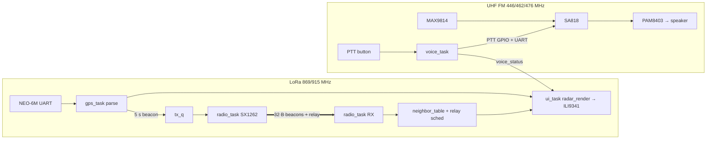

# 01 — System & Firmware Architecture (v2)

## Repository layout

```
ConvoyLink/
├── docs/                      # Design docs — the source of truth
├── tasks/                     # Implementation task queue + STATUS.md
├── firmware/
│   ├── components/            # ESP-IDF components (shared code)
│   │   ├── convoy_proto/      # Packet formats + (de)serialisation   [pure C]
│   │   ├── convoy_geo/        # Geodesy math (equirect, bearing)     [pure C]
│   │   ├── nmea/              # NMEA 0183 parser (RMC/GGA)           [pure C]
│   │   ├── neighbor_table/    # Per-car state, staleness, relay dedup[pure C]
│   │   ├── radar_render/      # RGB565 framebuffer gfx + radar UI    [pure C]
│   │   ├── convoy_pins/       # Pin map header (from docs/02)        [header]
│   │   ├── sx1262/            # LoRa driver (vendored core + wrapper)[ESP32]
│   │   ├── sa818/             # Voice module UART/PTT control        [ESP32]
│   │   ├── gps_uart/          # UART glue feeding nmea               [ESP32]
│   │   ├── unit_cfg/          # NVS identity + region + voice channel[ESP32]
│   │   └── ili9341_disp/      # esp_lcd wrapper, strip flushing      [ESP32]
│   └── apps/                  # Each subdir = standalone ESP-IDF project
│       ├── convoylink/        # The real firmware
│       ├── bringup_display/   # Test pattern + FPS counter
│       ├── bringup_gps/       # NMEA echo + parsed fix printout
│       ├── bringup_radio/     # LoRa ping + RSSI/SNR range logger
│       └── bringup_voice/     # SA818 exerciser (channel, PTT, RSSI)
├── sim/                       # Desktop radar simulator (SDL2, reuses pure-C components)
├── test/host/                 # Host unit tests for all pure-C components (gcc + make)
├── tools/                     # CI build script, helper scripts
└── .github/workflows/ci.yml   # Host tests + all-apps firmware build
```

**Pure C** components must compile with plain `gcc -std=c11` and no ESP-IDF
headers — that is what makes them host-testable and simulator-reusable.
They may not call `esp_*`, FreeRTOS, or allocate after init. Hardware
components wrap them. (v2 removed the `adpcm`, `audio_io` and `voice_pipe`
components: voice is analog on the SA818 and firmware carries no audio
samples at all.)

## The two-radio design

- **Data plane** — SX1262 LoRa: position beacons, relay, range pings.
  Multi-km. Owned exclusively by `radio_task`.
- **Voice plane** — SA818 analog UHF FM: PTT speech, mic→module→speaker in
  hardware. Multi-km. Owned exclusively by `voice_task` (UART + PTT GPIO
  only — no samples).

The planes share nothing but the UI. Either works without the other: the
radar milestone (M4) ships before voice is wired, and a dead voice module
never affects the radar.

## FreeRTOS task layout (app `convoylink`)

ESP32-S3, two Xtensa LX7 cores. Radio timing on core 1, everything else
core 0.

| Task | Core | Prio | Period / trigger | Role |
|---|---|---|---|---|
| `radio_task` | 1 | 12 | SX1262 DIO1 IRQ + `tx_q` | Owns the LoRa radio. RX → validate → dispatch; TX beacons/relays with cheap listen-before-talk |
| `voice_task` | 1 | 8 | PTT events + 150 ms poll tick | Owns the SA818: channel config at boot, PTT state machine, RSSI carrier-detect, publishes `voice_status` |
| `gps_task` | 0 | 6 | UART RX events | Feeds bytes to `nmea`, publishes fixes to `state`, queues own beacon every 5 s |
| `ui_task` | 0 | 4 | 200 ms tick | Reads `state` snapshot, renders radar via `radar_render`, flushes strips to LCD |
| `ctrl_task` | 0 | 5 | GPIO events, 50 ms debounce | PTT/AUX buttons → events for voice_task / ui_task |

### Shared state & queues (no ad-hoc globals)

```
state (struct convoy_state, mutex-guarded, snapshot-copied by readers)
 ├── own_fix        (nmea_fix_t + fix age)
 ├── neighbors      (neighbor_table_t)
 └── voice_status   (IDLE / TX / RX / BUSY, for UI)

tx_q   radio_task ← gps_task (beacons), relay scheduler
ctrl_q voice_task/ui_task ← ctrl_task (button events)
```

Rules: `radio_task` is the **only** task touching the SX1262; `voice_task`
the only one touching the SA818 (UART and PTT pin). `ui_task` never blocks
on anything but its tick. All queues are fixed-depth, drop-oldest on
overflow, depth documented in code. No heap allocation after `app_main`
finishes init.

## Dataflow



## Memory budget (ESP32-S3: 512 KB SRAM + 8 MB PSRAM; Wi-Fi/BT never initialised)

| Buffer | Size | Notes |
|---|---|---|
| LCD strip buffer | 240 × 20 px × 2 B × 2 = 19.2 KB | Double-buffered strips; a full framebuffer is deliberately NOT used |
| Neighbour table | 5 × ~64 B | Static |
| tx_q | 8 × 32 B | |
| UART buffers (GPS + SA818) | ~2 KB | Driver-owned, allocated at init |
| Queues + stacks | ~20 KB | Stack sizes in code, reviewed per task |

The S3's internal SRAM alone covers everything above with room to spare;
the 8 MB PSRAM is unused by design (keeps the radio path allocation-free
and deterministic — no PSRAM latency on hot paths). A full 240×320
framebuffer (150 KB) would now *fit* in SRAM, but strip rendering stays for
simplicity and to keep the `radar_render` contract identical to the
simulator. Wi-Fi and Bluetooth are **never initialised**.

## Error-handling conventions

- Pure-C components: return `int` (0 = OK, negative = error enum in the
  component's header). No `assert()` in library code; validate inputs.
- ESP components: return `esp_err_t`, log with `ESP_LOGx` using the
  component name as tag.
- The firmware must run forever with **any** peripheral absent: no GPS fix
  → radar shows NO FIX; SX1262 init fails → `RADIO?` tile + retry every
  5 s; SA818 unresponsive → `VOICE?` tile + config re-apply retries; never
  `abort()` on peripheral errors.

## Configuration & identity

All five units run an **identical binary**. NVS holds: `unit_id` (0–4),
`initials` (2 ASCII), `region` (EU/US/AU — selects LoRa frequency), and
`voice_channel` (frequency plan per `docs/04`). Set once over the serial
console (`docs/07` §Provisioning). Compile-time tunables live in
`convoy_cfg.h` so the simulator sees the same numbers.
