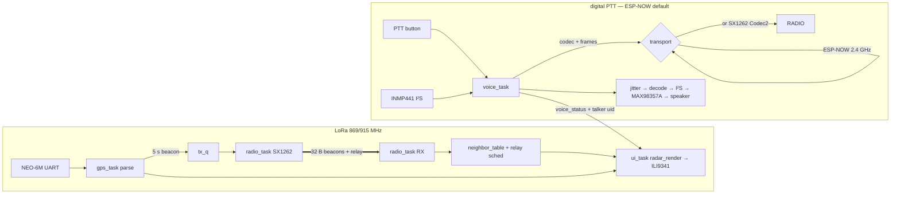

# 01 — System & Firmware Architecture (v3)

## Repository layout

```
ConvoyLink/
├── docs/                      # Design docs — the source of truth
├── tasks/                     # Implementation task queue + STATUS.md
├── firmware/
│   ├── components/            # ESP-IDF components (shared code)
│   │   ├── convoy_proto/      # Beacon packet formats + validation   [pure C]
│   │   ├── convoy_geo/        # Geodesy math (equirect, bearing)     [pure C]
│   │   ├── adpcm/             # IMA ADPCM codec (ESP-NOW voice)      [pure C]
│   │   ├── voice_pipe/        # Voice framing + jitter + conceal      [pure C]
│   │   ├── nmea/              # NMEA 0183 parser (RMC/GGA)           [pure C]
│   │   ├── neighbor_table/    # Per-car state, staleness, relay dedup[pure C]
│   │   ├── radar_render/      # RGB565 framebuffer gfx + radar UI    [pure C]
│   │   ├── convoy_pins/       # Pin map header (from docs/02)        [header]
│   │   ├── sx1262/            # LoRa driver (vendored core + wrapper)[ESP32]
│   │   ├── audio_io/          # I²S mic capture + speaker playback   [ESP32]
│   │   ├── voice_transport/   # ESP-NOW + (later) SX1262 transports  [ESP32]
│   │   ├── gps_uart/          # UART glue feeding nmea               [ESP32]
│   │   ├── unit_cfg/          # NVS identity + region + voice xport  [ESP32]
│   │   └── ili9341_disp/      # esp_lcd wrapper, strip flushing      [ESP32]
│   └── apps/                  # Each subdir = standalone ESP-IDF project
│       ├── convoylink/        # The real firmware
│       ├── bringup_display/   # Test pattern + FPS counter
│       ├── bringup_gps/       # NMEA echo + parsed fix printout
│       ├── bringup_radio/     # LoRa ping + RSSI/SNR range logger
│       └── bringup_audio/     # I²S mic-meter / loopback / codec bench
├── sim/                       # Desktop radar simulator (SDL2, reuses pure-C components)
├── test/host/                 # Host unit tests for all pure-C components (gcc + make)
├── tools/                     # CI build script, helper scripts
└── .github/workflows/ci.yml   # Host tests + all-apps firmware build
```

**Pure C** components must compile with plain `gcc -std=c11` and no ESP-IDF
headers — that is what makes them host-testable and simulator-reusable.
They may not call `esp_*`, FreeRTOS, or allocate after init. Hardware
components wrap them. (v3 brought `adpcm` back for the digital voice path
and added `audio_io`/`voice_transport`; the analog `sa818` component is
retired to the licensed-variant appendix in `docs/04`.)

## The two-plane design

- **Data plane** — SX1262 LoRa: position beacons, relay, range pings.
  Multi-km. Owned exclusively by `radio_task`.
- **Voice plane** — digital PTT (`docs/04`): I²S mic → codec → frames →
  jitter buffer → I²S amp, owned by `voice_task`. The frames go out over a
  **swappable transport**:
  - **ESP-NOW** (default, ships first) — the S3's own 2.4 GHz radio, fully
    independent of the SX1262, so voice and positions run simultaneously.
  - **SX1262/Codec2** (range upgrade) — shares the LoRa chip, so
    `radio_task` arbitrates beacon-vs-voice mode (the reason it's a
    follow-on; see `docs/04`).

The data plane and the ESP-NOW voice plane share nothing but the UI —
either works without the other, the radar milestone (M4) ships before voice
exists, and a voice fault never touches the radar. Only the SX1262 voice
transport couples the two (through `radio_task`).

## FreeRTOS task layout (app `convoylink`)

ESP32-S3, two Xtensa LX7 cores. Radio timing on core 1, everything else
core 0.

| Task | Core | Prio | Period / trigger | Role |
|---|---|---|---|---|
| `radio_task` | 1 | 12 | SX1262 DIO1 IRQ + `tx_q` | Owns the LoRa radio. RX → validate → dispatch; TX beacons/relays with cheap listen-before-talk |
| `voice_task` | 1 | 8 | PTT events + I²S DMA + transport RX | Owns the voice pipeline: `audio_io` (I²S), codec, jitter buffer, PTT state machine, and the selected `voice_transport`; publishes `voice_status` (incl. talker uid) |
| `gps_task` | 0 | 6 | UART RX events | Feeds bytes to `nmea`, publishes fixes to `state`, queues own beacon every 5 s |
| `ui_task` | 0 | 4 | 200 ms tick | Reads `state` snapshot, renders radar via `radar_render`, flushes strips to LCD |
| `ctrl_task` | 0 | 5 | GPIO events, 50 ms debounce | PTT/AUX buttons → events for voice_task / ui_task |

### Shared state & queues (no ad-hoc globals)

```
state (struct convoy_state, mutex-guarded, snapshot-copied by readers)
 ├── own_fix        (nmea_fix_t + fix age)
 ├── neighbors      (neighbor_table_t)
 └── voice_status   (IDLE / TX / RX / BUSY, for UI)

tx_q   radio_task ← gps_task (beacons), relay scheduler
ctrl_q voice_task/ui_task ← ctrl_task (button events)
```

Rules: `radio_task` is the **only** task touching the SX1262; `voice_task`
the only one touching `audio_io` (I²S) and the ESP-NOW radio. (When the
SX1262 voice transport is selected, `voice_task` reaches the radio *through*
`radio_task`, never directly — the chip has one owner.) `ui_task` never
blocks on anything but its tick. All queues are fixed-depth, drop-oldest on
overflow, depth documented in code. No heap allocation after `app_main`
finishes init.

## Dataflow



## Memory budget (ESP32-S3: 512 KB SRAM + 8 MB PSRAM)

| Buffer | Size | Notes |
|---|---|---|
| LCD strip buffer | 240 × 20 px × 2 B × 2 = 19.2 KB | Double-buffered strips; a full framebuffer is deliberately NOT used |
| I²S DMA (mic + amp) | ~4 KB | Small multiple of a 20 ms frame |
| Jitter buffer + PCM/codec scratch | ~4 KB | 16 voice frames + decode scratch |
| Neighbour table | 5 × ~64 B | Static |
| tx_q | 8 × 32 B | |
| UART buffer (GPS) | ~1 KB | Driver-owned |
| Wi-Fi stack (ESP-NOW only) | ~50 KB | Present only when `voice_transport = espnow` |
| Queues + stacks | ~20 KB | Stack sizes in code, reviewed per task |

The S3's internal SRAM covers all of this with room to spare; the 8 MB
PSRAM is unused by design (keeps the radio/audio paths allocation-free and
deterministic — no PSRAM latency on hot paths). **Radio use is
constrained, not banned:** Wi-Fi is brought up *only* for ESP-NOW —
connectionless, STA mode, fixed channel, never associating/hosting/scanning
— and Bluetooth is never initialised (`docs/04` §invariant). If
`voice_transport = sx1262`, Wi-Fi stays down and that 50 KB is free.

## Error-handling conventions

- Pure-C components: return `int` (0 = OK, negative = error enum in the
  component's header). No `assert()` in library code; validate inputs.
- ESP components: return `esp_err_t`, log with `ESP_LOGx` using the
  component name as tag.
- The firmware must run forever with **any** peripheral absent: no GPS fix
  → radar shows NO FIX; SX1262 init fails → `RADIO?` tile + retry every
  5 s; audio_io/transport init fails → `VOICE?` tile, radar unaffected;
  never `abort()` on peripheral errors.

## Configuration & identity

All five units run an **identical binary**. NVS holds: `unit_id` (0–4),
`initials` (2 ASCII), `region` (EU/US/AU — selects LoRa frequency), and
`voice_transport` (`espnow` default | `sx1262`, per `docs/04`). Set once
over the serial console (`docs/07` §Provisioning). Compile-time tunables
live in `convoy_cfg.h` so the simulator sees the same numbers.
